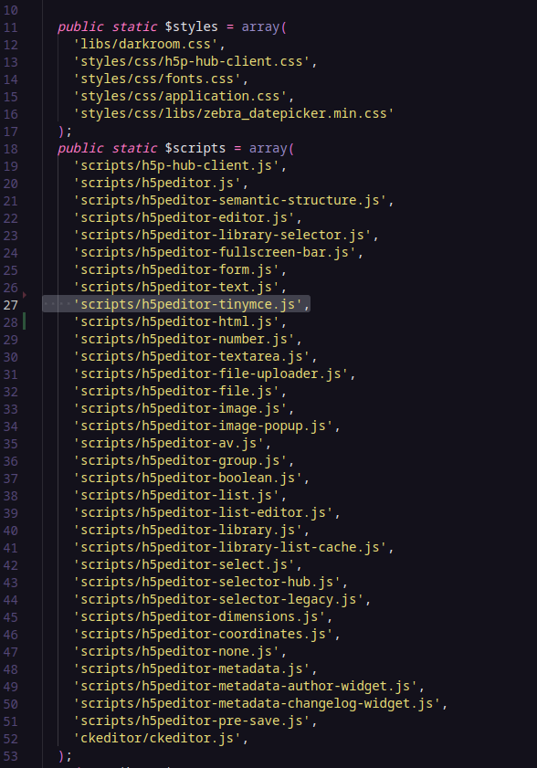

## Integração do Editor de Texto H5P

Este repositório contém arquivos essenciais para integrar um novo editor de texto H5P em seu ambiente, especialmente em plataformas Moodle. Siga as instruções abaixo para uma integração bem-sucedida:

1. **`h5peditor-tinymce.js` - Renderização do Novo Editor de Texto**
   - Faça o download do arquivo `[h5peditor-tinymce.js](https://github.com/RamonSVieira/H5P.TextEditor-scripts/blob/main/h5peditor-tinymce.js)`.
   - Coloque este arquivo na mesma pasta do seu `h5peditor-html.js`. Em ambientes Moodle, o caminho padrão pode ser `www/html/h5p/h5plib/v124/joubel/editor/scripts/`.
2. **`h5peditor-file.class.php` - Chamar os Scripts no Projeto Existente**

   - Verifique se o arquivo `h5peditor-file.class.php` já está presente no seu projeto. Em ambientes Moodle, o caminho padrão pode ser `www/html/h5p/h5plib/v124/joubel/editor/h5peditor.class.php`.
   - Adicione o caminho do arquivo `[h5peditor-tinymce.js](https://github.com/RamonSVieira/H5P.TextEditor-scripts/blob/main/h5peditor-tinymce.js)` uma linha acima de onde o script `h5peditor-html.js` é chamado.

   

**Observação:** Os caminhos mencionados acima são específicos para ambientes Moodle e podem variar de acordo com a plataforma que você está utilizando.
